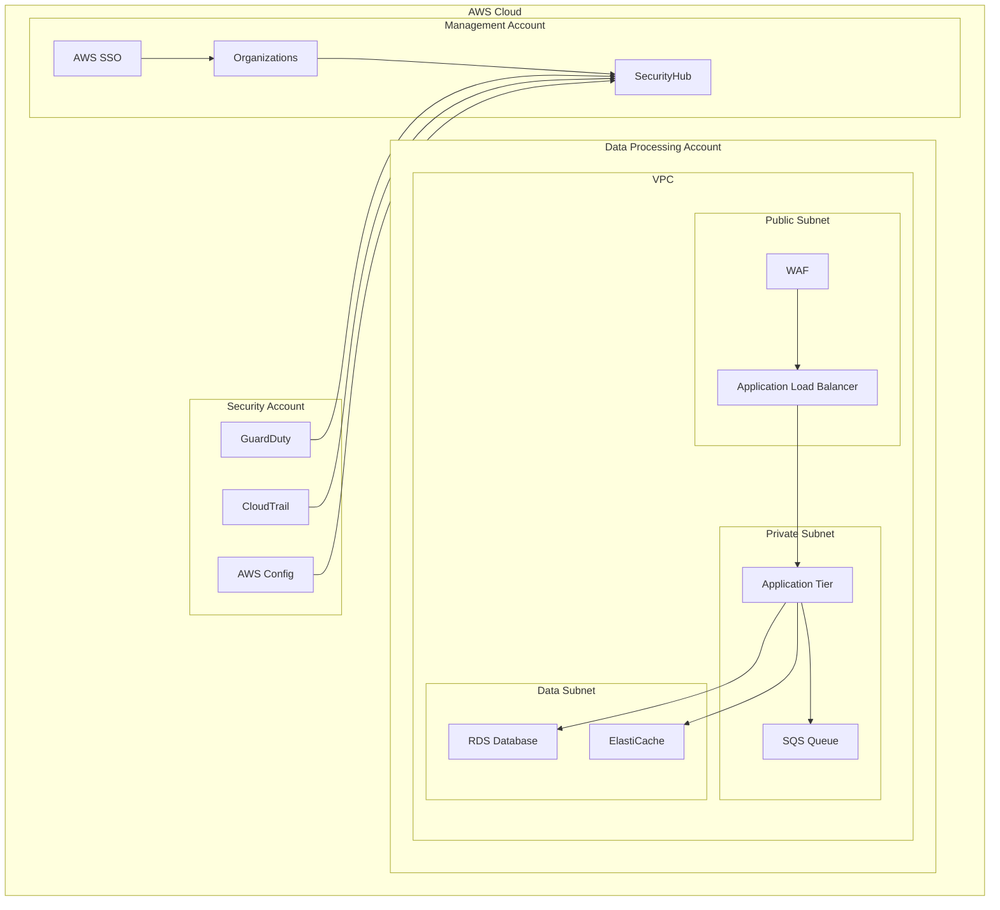

# Secure Data Platform Capstone Project

## Overview
Build a comprehensive data security platform that combines concepts from multiple labs to create a secure, scalable, and compliant data processing environment in AWS.

## Learning Objectives
1. Design and implement end-to-end data security
2. Apply multiple security controls in layers
3. Implement automated compliance monitoring
4. Create incident response procedures
5. Demonstrate security best practices

## Project Components

### 1. Infrastructure Security (Labs 1, 2, 8)
- VPC with public and private subnets
- Network segmentation and security groups
- AWS Organizations for multi-account management
- Infrastructure as Code using CloudFormation

### 2. Identity Management (Labs 3, 7)
- IAM roles and policies using least privilege
- AWS SSO integration
- MFA enforcement
- Automated access reviews

### 3. Data Protection (Labs 5, 6)
- Encryption at rest and in transit
- Key management using AWS KMS
- Secrets management
- Data classification and DLP

### 4. Monitoring and Response (Labs 4, 9)
- Security monitoring using GuardDuty
- Log aggregation and analysis
- Automated incident response
- Compliance reporting

### 5. Application Security (Labs 8, 10)
- WAF implementation
- API security
- Container security
- CI/CD security integration

## Implementation Steps

1. **Infrastructure Setup**
   ```bash
   # Deploy base infrastructure
   aws cloudformation create-stack \
     --stack-name secure-data-platform \
     --template-body file://infrastructure/main.yaml
   ```

2. **Identity Configuration**
   ```bash
   # Configure AWS SSO
   aws sso-admin create-instance \
     --instance-arn arn:aws:sso:::instance/ssoins-xxxxxxxxxxxxx
   ```

3. **Data Protection Implementation**
   ```bash
   # Create KMS keys
   aws kms create-key \
     --description "Data encryption key" \
     --policy file://policies/key-policy.json
   ```

4. **Monitoring Setup**
   ```bash
   # Enable GuardDuty
   aws guardduty create-detector \
     --enable \
     --data-sources S3Logs={Enable=true}
   ```

5. **Application Security**
   ```bash
   # Deploy WAF rules
   aws wafv2 create-web-acl \
     --name secure-data-platform \
     --scope REGIONAL \
     --default-action Block={} \
     --rules file://security/waf-rules.json
   ```

## Architecture



## Security Controls

### Network Security
- VPC Flow Logs enabled
- Security groups with least privilege
- Network ACLs for subnet isolation
- VPC endpoints for AWS services

### Data Security
- KMS encryption for all data at rest
- TLS 1.3 for data in transit
- S3 bucket policies and encryption
- Database encryption and auditing

### Identity Security
- Role-based access control
- Just-in-time access
- Session monitoring
- Access reviews

### Application Security
- WAF rules and rate limiting
- API authentication and authorization
- Container image scanning
- Secrets rotation

## Compliance Requirements

### Documentation
- Architecture diagrams
- Security controls matrix
- Risk assessment
- Compliance mappings

### Monitoring
- Security metrics dashboard
- Compliance reports
- Audit logs
- Alert configurations

### Procedures
- Incident response playbook
- Change management process
- Access request workflow
- Disaster recovery plan

## Testing and Validation

### Security Testing
1. Penetration testing plan
2. Vulnerability scanning
3. Configuration auditing
4. Access control testing

### Compliance Testing
1. Control validation
2. Policy enforcement
3. Audit trail verification
4. Report generation

## Deliverables

1. **Documentation**
   - Design documents
   - Security architecture
   - Implementation guides
   - Operational procedures

2. **Infrastructure Code**
   - CloudFormation templates
   - AWS CLI scripts
   - Configuration files
   - Policy documents

3. **Security Configurations**
   - IAM policies
   - Security group rules
   - WAF configurations
   - Monitoring rules

4. **Operational Tools**
   - Monitoring dashboards
   - Response playbooks
   - Automation scripts
   - Compliance reports

## Success Criteria

1. **Security**
   - All data encrypted
   - Access controls implemented
   - Monitoring enabled
   - Incident response tested

2. **Compliance**
   - Controls documented
   - Audit logs available
   - Reports automated
   - Policies enforced

3. **Operations**
   - Automation implemented
   - Procedures documented
   - Training completed
   - Support process defined

## Resources

### AWS Documentation
- [AWS Security Best Practices](https://aws.amazon.com/architecture/security-identity-compliance/)
- [AWS Compliance Programs](https://aws.amazon.com/compliance/programs/)
- [AWS Security Documentation](https://docs.aws.amazon.com/security/)

### Tools
- [AWS CloudFormation](https://aws.amazon.com/cloudformation/)
- [AWS CLI](https://aws.amazon.com/cli/)
- [AWS Security Hub](https://aws.amazon.com/security-hub/)
- [AWS GuardDuty](https://aws.amazon.com/guardduty/) 