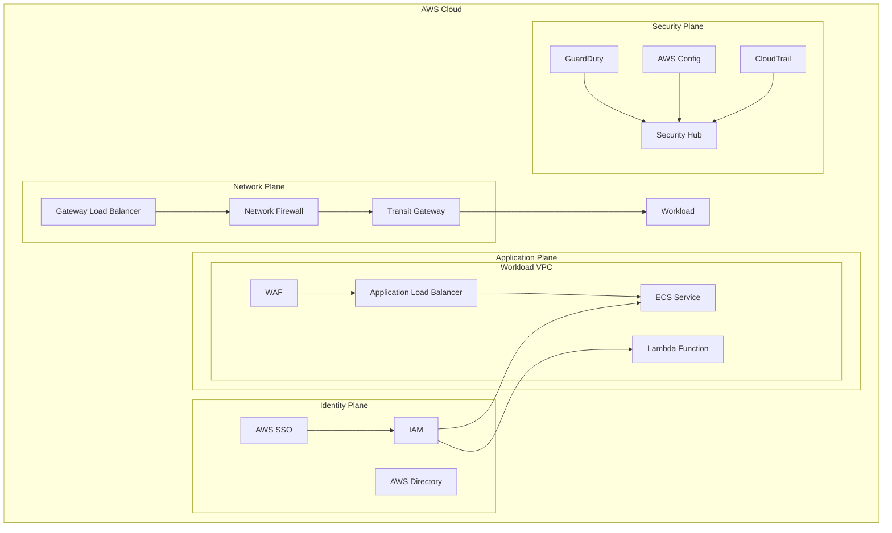

# Zero Trust Implementation Challenge

## Overview
Implement a comprehensive zero trust architecture in AWS by combining concepts from multiple labs to create a secure environment that follows the principle of "never trust, always verify."

## Labs Involved
- Lab 1: AWS Account Governance
- Lab 2: Network Security
- Lab 3: Identity and Access Management
- Lab 4: Security Monitoring
- Lab 7: Access Management and Federation
- Lab 8: Infrastructure Protection

## Challenge Objectives

### 1. Identity and Access Management
- Implement fine-grained access controls
- Configure AWS SSO with MFA
- Set up just-in-time access
- Create automated access reviews

### 2. Network Security
- Implement network segmentation
- Configure VPC endpoints
- Set up AWS Network Firewall
- Enable advanced network monitoring

### 3. Resource Protection
- Implement service endpoints
- Configure security groups
- Set up WAF rules
- Enable DDoS protection

### 4. Data Security
- Implement encryption at rest
- Configure encryption in transit
- Set up key management
- Enable data access monitoring

### 5. Continuous Monitoring
- Configure GuardDuty
- Set up Security Hub
- Enable AWS Config
- Implement custom security metrics

## Implementation Steps

### Phase 1: Identity Foundation
```bash
# Configure AWS SSO
aws sso-admin create-instance \
  --instance-arn arn:aws:sso:::instance/ssoins-xxxxxxxxxxxxx

# Set up permission sets
aws sso-admin create-permission-set \
  --instance-arn $SSO_INSTANCE_ARN \
  --name "ZeroTrustAdmin" \
  --description "Zero Trust Administrator"
```

### Phase 2: Network Security
```bash
# Create VPC with isolated subnets
aws ec2 create-vpc \
  --cidr-block 10.0.0.0/16 \
  --tag-specifications 'ResourceType=vpc,Tags=[{Key=Name,Value=ZeroTrustVPC}]'

# Configure Network Firewall
aws network-firewall create-firewall \
  --firewall-name zero-trust-fw \
  --firewall-policy-arn $POLICY_ARN \
  --vpc-id $VPC_ID \
  --subnet-mappings SubnetId=$SUBNET_ID
```

### Phase 3: Resource Protection
```bash
# Create WAF web ACL
aws wafv2 create-web-acl \
  --name zero-trust-acl \
  --scope REGIONAL \
  --default-action Block={} \
  --rules file://waf-rules.json

# Configure security groups
aws ec2 create-security-group \
  --group-name zero-trust-sg \
  --description "Zero Trust Security Group"
```

### Phase 4: Monitoring
```bash
# Enable GuardDuty
aws guardduty create-detector \
  --enable \
  --data-sources S3Logs={Enable=true}

# Configure Security Hub
aws securityhub enable-security-hub \
  --enable-default-standards \
  --tags Environment=ZeroTrust
```

## Architecture



## Security Controls Matrix

| Control Category | Control | Implementation | Validation |
|-----------------|---------|----------------|------------|
| Identity | MFA | AWS SSO | Access logs |
| Identity | JIT Access | IAM roles | CloudTrail |
| Network | Segmentation | VPC design | VPC Flow Logs |
| Network | Filtering | Network Firewall | Traffic logs |
| Data | Encryption | KMS | CloudWatch |
| Data | Access | S3 policies | S3 logs |
| Application | WAF | Rules | WAF logs |
| Application | Security Groups | Rules | Flow logs |

## Validation Tests

### 1. Identity Tests
```bash
# Test SSO login
aws sso login --profile zero-trust

# Verify MFA
aws iam get-account-summary
```

### 2. Network Tests
```bash
# Test network isolation
aws ec2 describe-network-interfaces

# Verify firewall rules
aws network-firewall describe-firewall
```

### 3. Resource Tests
```bash
# Test WAF rules
curl -v https://api.example.com

# Verify security groups
aws ec2 describe-security-groups
```

### 4. Monitoring Tests
```bash
# Check GuardDuty findings
aws guardduty list-findings

# Verify Security Hub
aws securityhub get-findings
```

## Success Criteria

### Identity and Access
- [ ] All access requires MFA
- [ ] Just-in-time access implemented
- [ ] Access reviews automated
- [ ] Session monitoring enabled

### Network Security
- [ ] All subnets isolated
- [ ] Traffic filtered at multiple layers
- [ ] VPC endpoints configured
- [ ] Network monitoring enabled

### Resource Protection
- [ ] WAF rules enforced
- [ ] Security groups restrictive
- [ ] Endpoints protected
- [ ] DDoS protection enabled

### Monitoring and Response
- [ ] GuardDuty enabled
- [ ] Security Hub configured
- [ ] Custom metrics created
- [ ] Alerts implemented

## Documentation Requirements

### 1. Design Documents
- Architecture diagrams
- Network flow diagrams
- Access control matrix
- Data flow diagrams

### 2. Implementation Guides
- Configuration procedures
- Deployment scripts
- Validation tests
- Troubleshooting guides

### 3. Operational Procedures
- Access request process
- Incident response plan
- Change management
- Backup and recovery

### 4. Compliance Evidence
- Control documentation
- Test results
- Audit logs
- Review reports

## Resources

### AWS Documentation
- [Zero Trust on AWS](https://aws.amazon.com/security/zero-trust/)
- [AWS Security Best Practices](https://aws.amazon.com/architecture/security-identity-compliance/)
- [AWS Network Security](https://docs.aws.amazon.com/vpc/latest/userguide/security.html)

### Tools and Scripts
- [AWS CLI](https://aws.amazon.com/cli/)
- [CloudFormation Templates](https://aws.amazon.com/cloudformation/)
- [AWS CDK](https://aws.amazon.com/cdk/)
- [Security Hub](https://aws.amazon.com/security-hub/)

### Additional Reading
- [NIST Zero Trust Architecture](https://www.nist.gov/publications/zero-trust-architecture)
- [AWS Security Blog](https://aws.amazon.com/blogs/security/)
- [AWS Whitepapers](https://aws.amazon.com/whitepapers/) 