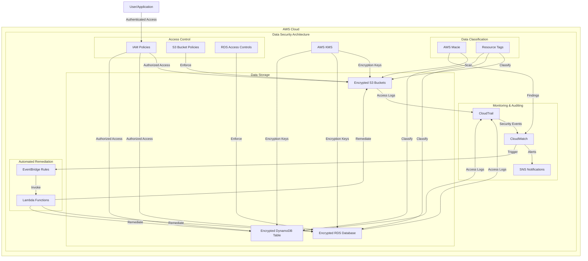
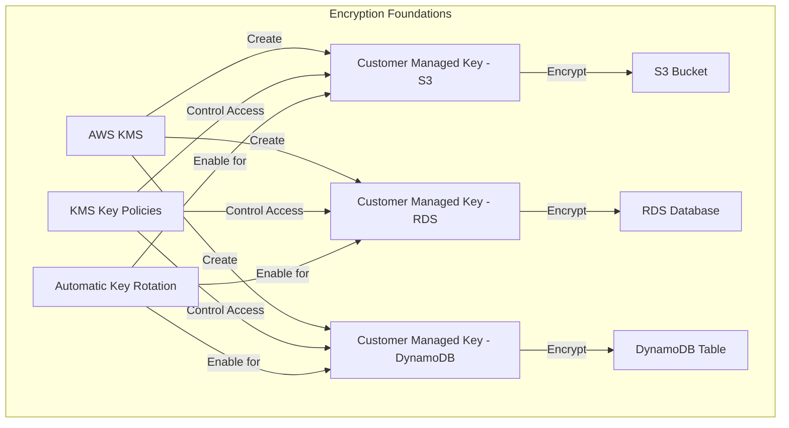
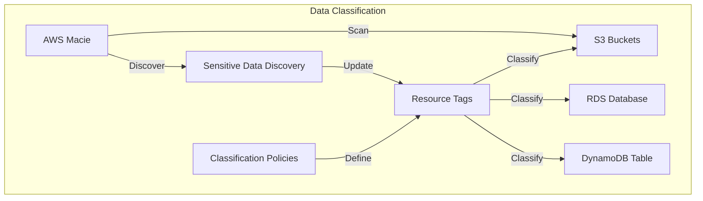
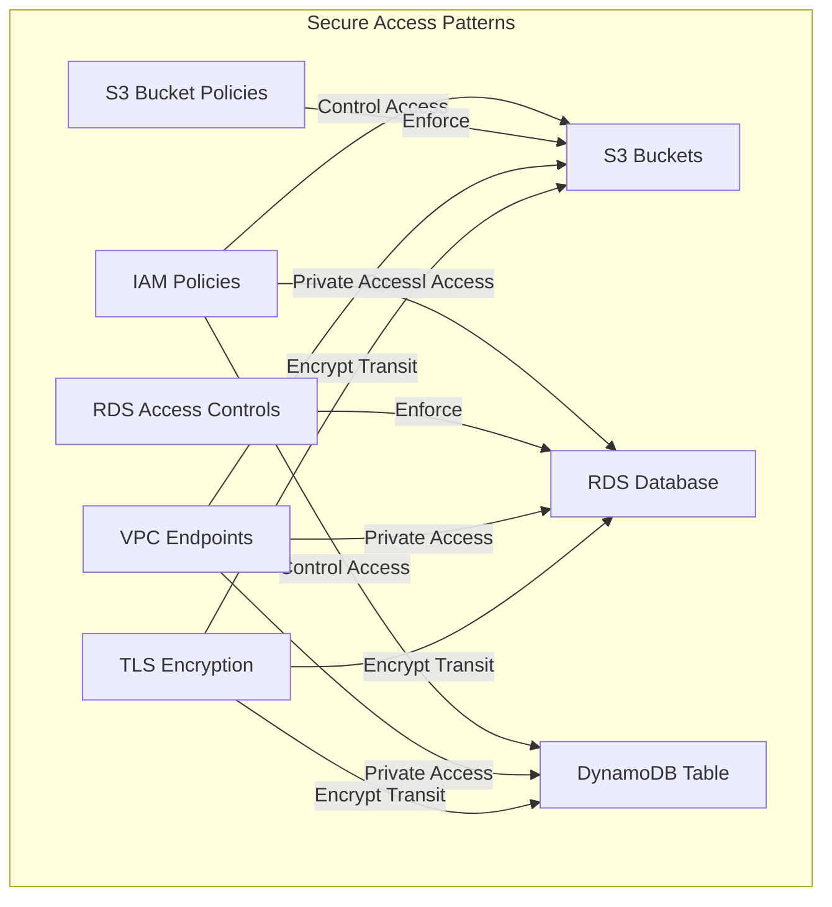
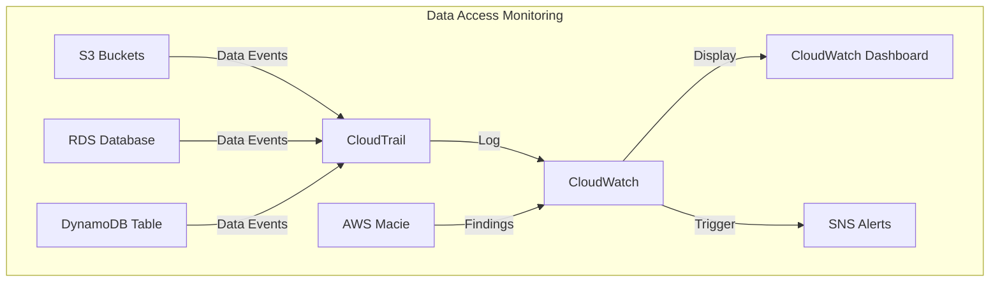
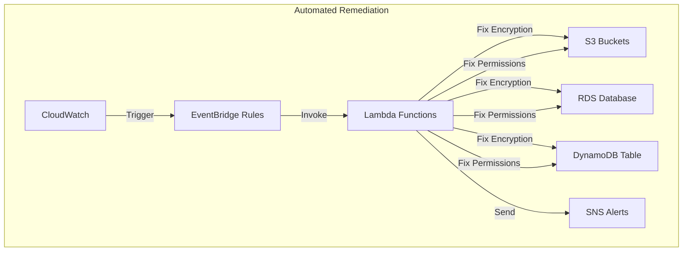

# Lab 6: Data Security - Architecture Diagram

This document provides a visual representation of the architecture you'll build in this lab.

## Overall Architecture

## Module 1: Encryption Foundations

## Module 2: Data Classification

## Module 3: Secure Access Patterns

## Module 4: Data Access Monitoring

## Module 5: Automated Remediation

