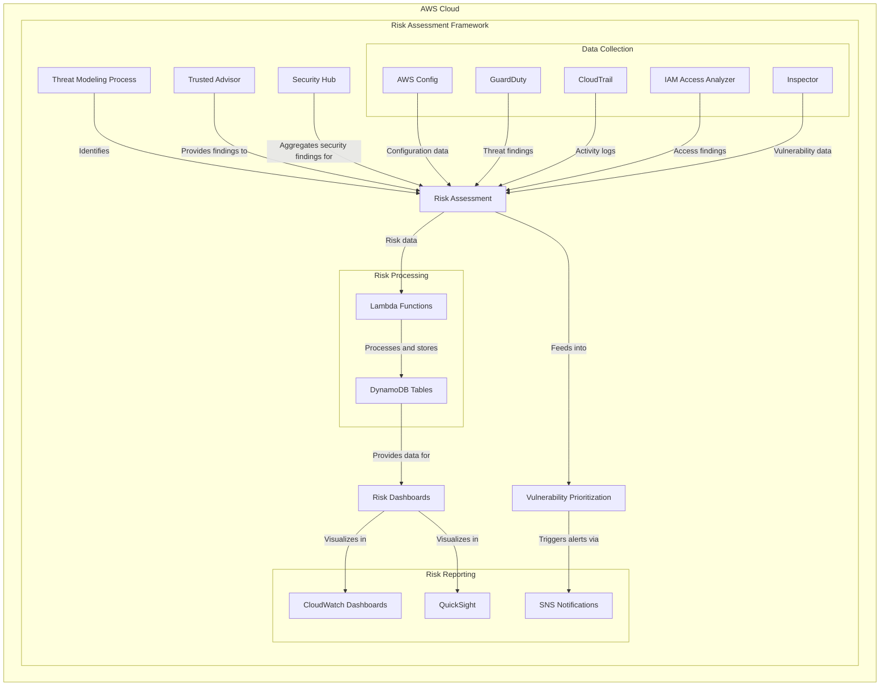
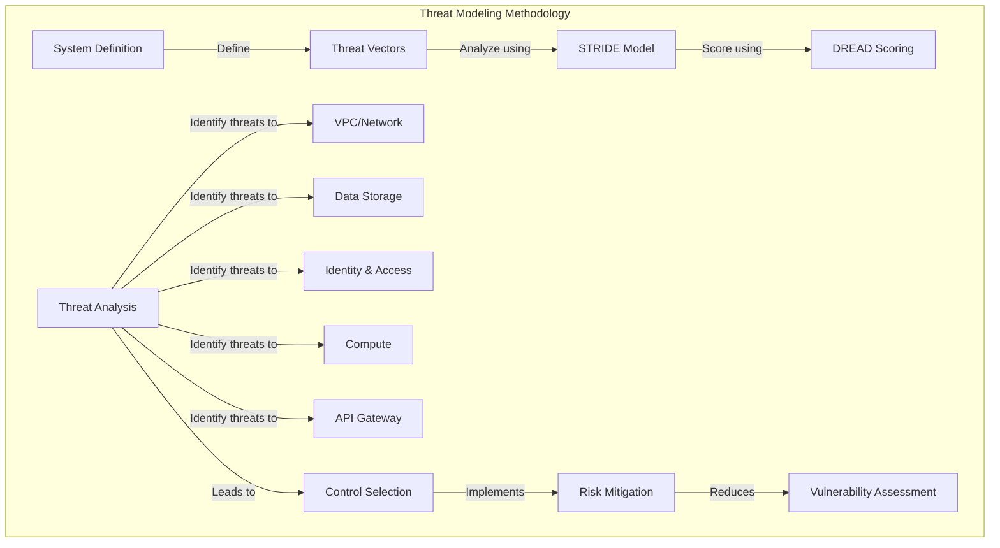
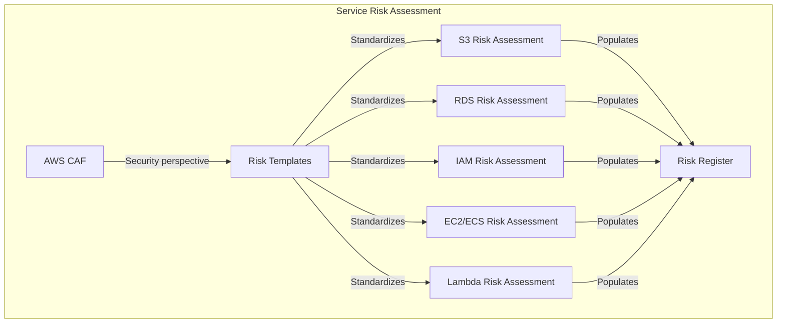
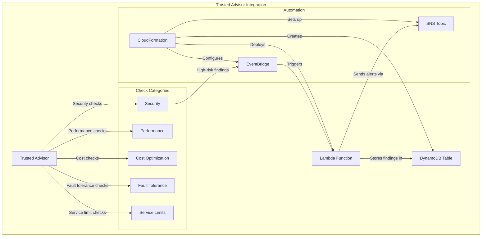
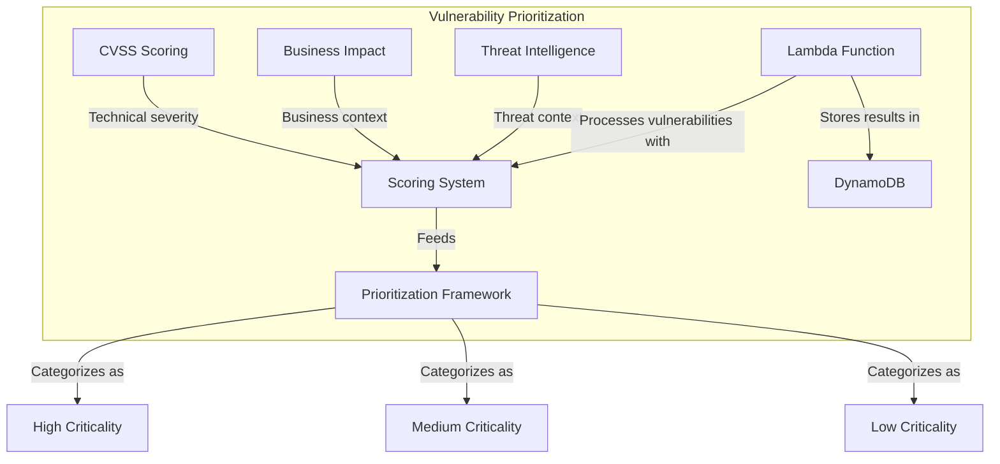
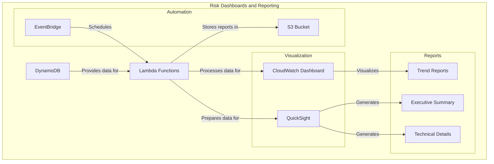

# Lab 7: Risk Assessment and Threat Modeling - Architecture Diagram

This document provides a visual representation of the architecture and workflows you'll build in this lab.

## Overall Architecture

## Module 1: AWS Threat Modeling Methodology

## Module 2: Service-Specific Risk Assessments

## Module 3: AWS Trusted Advisor Integration

## Module 4: Vulnerability Prioritization

## Module 5: Risk Dashboards and Reporting

