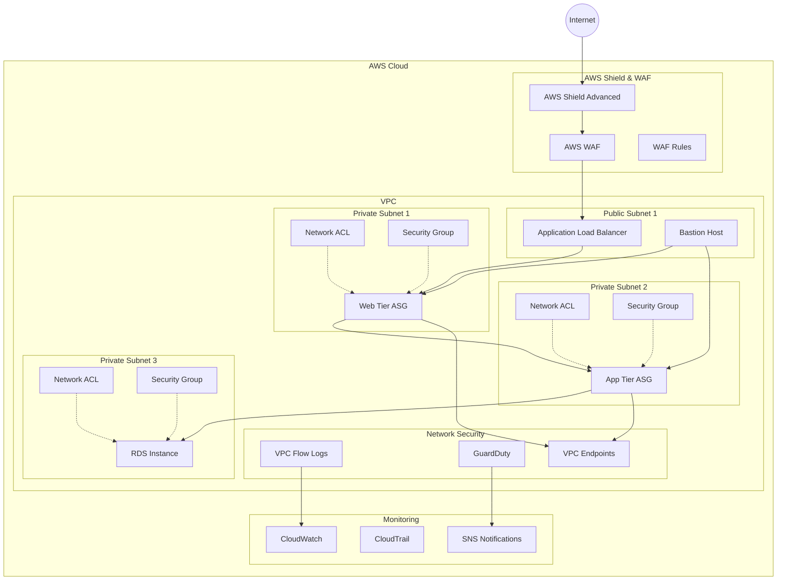
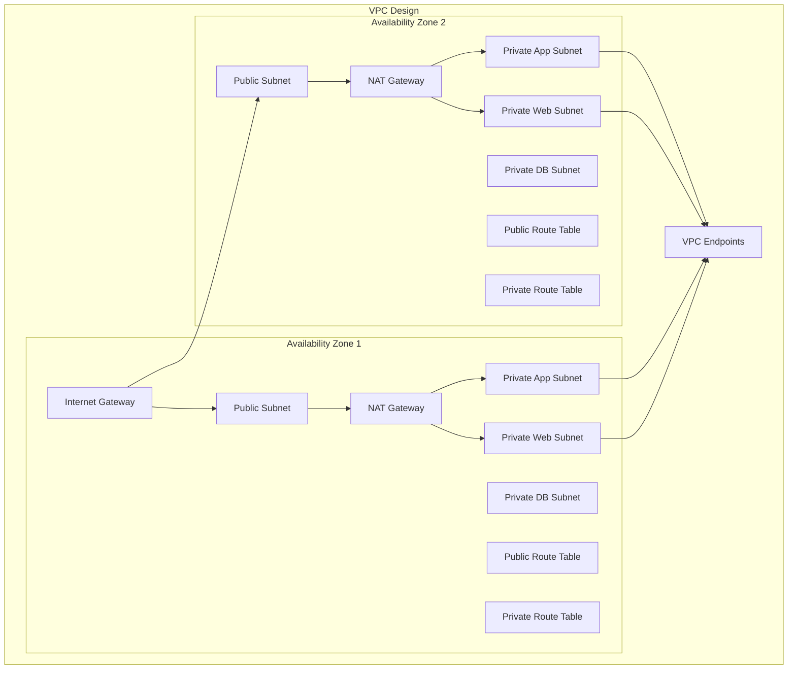
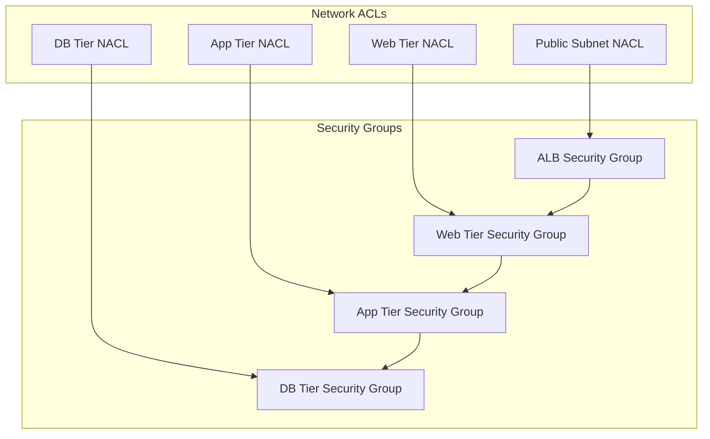
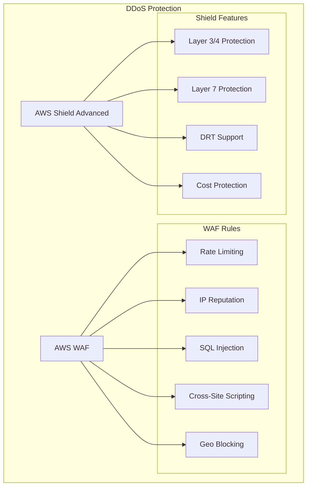
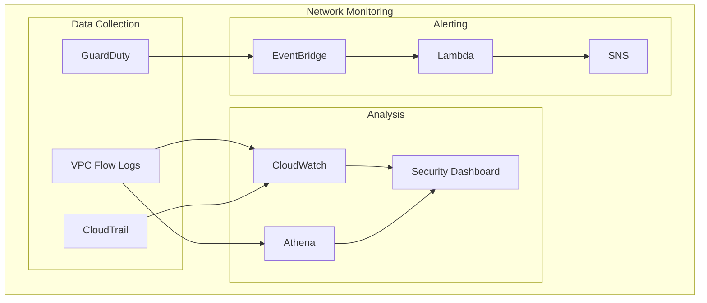
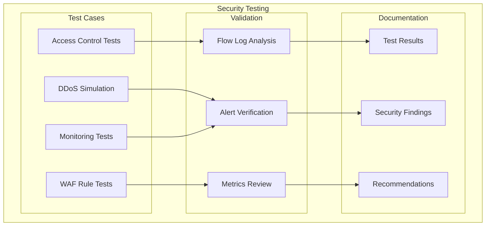

# Lab 8: Infrastructure and Network Protection - Architecture Diagram

This document provides a visual representation of the secure network infrastructure you'll build in this lab.

## Overall Architecture

## Module 1: Secure VPC Design

## Module 2: Network Access Controls

## Module 3: DDoS Protection

## Module 4: Network Monitoring

## Module 5: Network Security Testing

