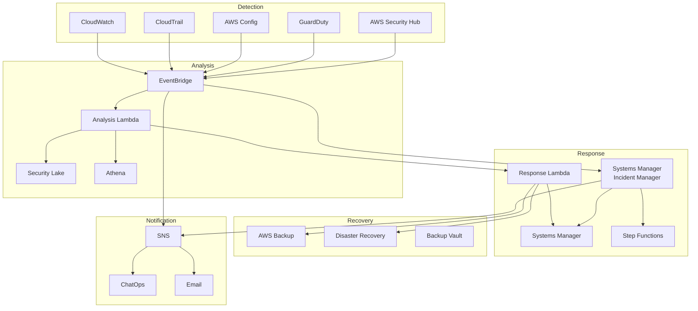
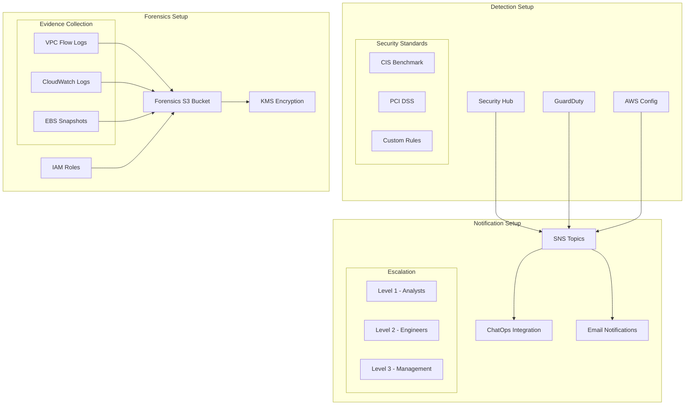
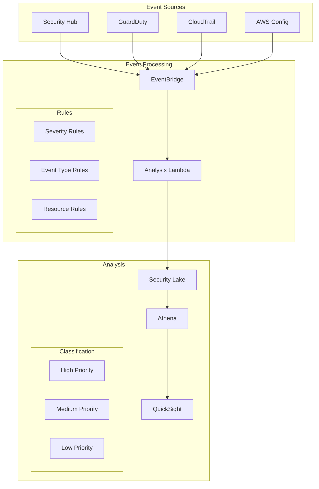
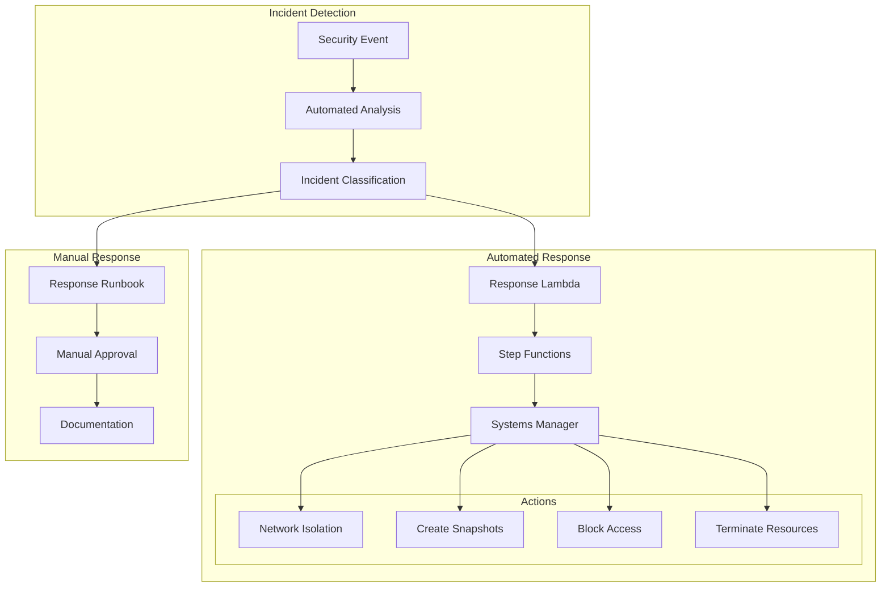
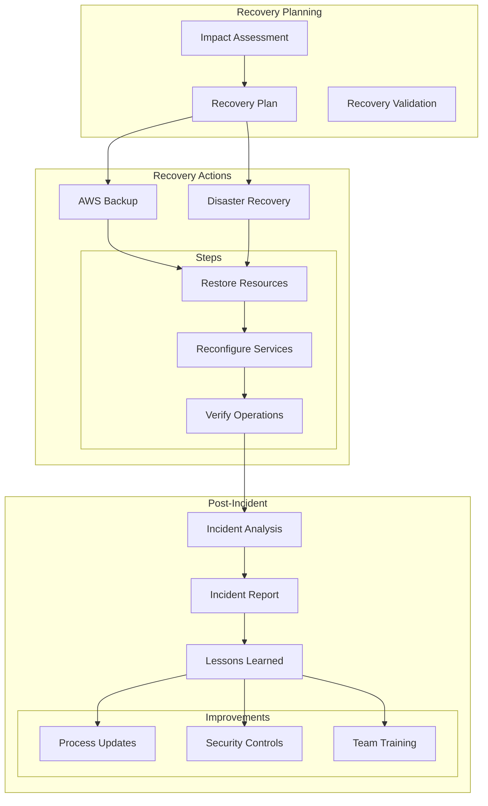
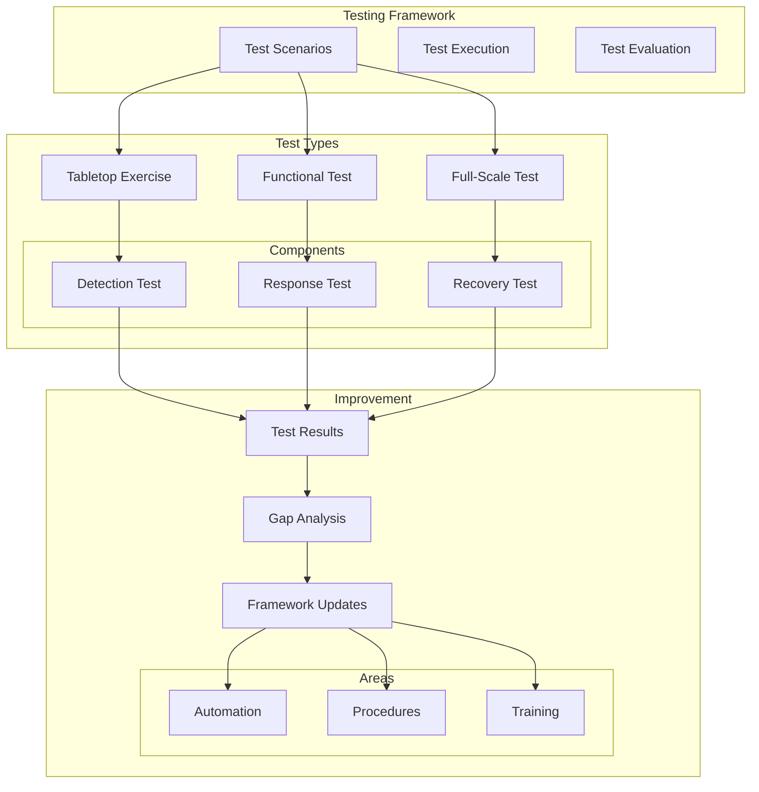

# Lab 9: Incident Response and Recovery - Architecture Diagram

This document provides a visual representation of the incident response and recovery framework you'll build in this lab.

## Overall Architecture

## Module 1: Incident Response Preparation

## Module 2: Detection and Analysis

## Module 3: Containment and Eradication

## Module 4: Recovery and Post-Incident

## Module 5: Testing and Improvement

