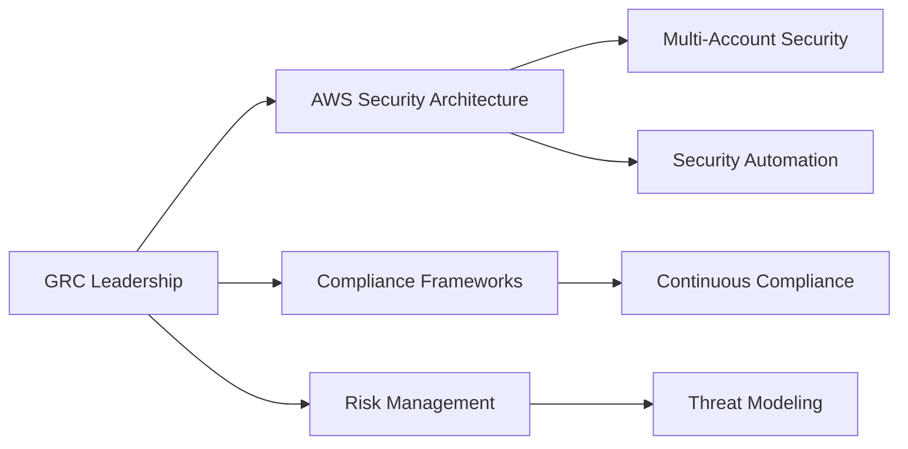

# GRC Professional Portfolio

<div align="center">
  <h1>[Your Name]</h1>
  <p><em>AWS Security & Compliance Specialist</em></p>
  
  <a href="mailto:your.email@example.com"></a>
  <a href="https://linkedin.com/in/yourprofile"></a>
  <a href="https://github.com/yourusername"></a>
  
  <p>
    
    
    
    
  </p>
</div>

## Professional Overview



[4-5 compelling sentences about your extensive experience in GRC, highlighting specialized expertise, notable achievements, and unique value proposition. Focus on executive-level communication about security posture improvement, compliance automation, and risk reduction.]

## Areas of Expertise

<table>
  <tr>
    <td width="33%" align="center">
      <br>
      <strong>AWS Security Architecture</strong><br>
      <small>Multi-account strategies, security services implementation, defense-in-depth</small>
    </td>
    <td width="33%" align="center">
      <br>
      <strong>Compliance Automation</strong><br>
      <small>Continuous compliance, evidence collection, audit readiness</small>
    </td>
    <td width="33%" align="center">
      <br>
      <strong>Risk Management</strong><br>
      <small>Threat modeling, vulnerability management, security metrics</small>
    </td>
  </tr>
  <tr>
    <td width="33%" align="center">
      <br>
      <strong>Security as Code</strong><br>
      <small>Infrastructure as code, policy as code, security guardrails</small>
    </td>
    <td width="33%" align="center">
      <br>
      <strong>Incident Response</strong><br>
      <small>Automated detection & response, forensics, playbooks</small>
    </td>
    <td width="33%" align="center">
      <br>
      <strong>Security Leadership</strong><br>
      <small>Strategy development, team building, executive communication</small>
    </td>
  </tr>
</table>

## Impact Metrics

| Area | Metric | Impact |
|------|--------|--------|
| 🔒 Compliance | Automated compliance controls | Reduced audit preparation time by 70% |
| 📉 Risk Management | Implemented continuous risk assessment | Decreased high-risk findings by 65% |
| 💰 Cost Optimization | Optimized security tooling | Reduced security tooling costs by 40% |
| ⏱️ Incident Response | Automated incident response | Decreased MTTR from 6 hours to 30 minutes |
| 🛡️ Threat Detection | Enhanced threat detection capabilities | Improved detection coverage by 85% |

## AWS Security Architecture Blueprint

```
[INSERT ARCHITECTURE DIAGRAM HERE - Create a detailed architecture diagram showing your AWS security implementation]
```

*An example multi-account AWS security architecture implementing defense-in-depth with centralized security services, automated compliance checks, and least-privilege access controls.*

## Enterprise Security Portfolio

### [Enterprise-Level Project 1: Multi-Account Security Framework]

**Business Challenge**: 
[Describe the complex business challenge this project addressed - focus on organizational risk, compliance requirements, and business impact]

**Solution Architecture**:
```
[INSERT PROJECT ARCHITECTURE DIAGRAM - Show the multi-account security architecture you designed]
```

**Key Implementation Components**:
- Designed and implemented a comprehensive AWS multi-account strategy with security-focused organizational units
- Created a centralized security services account with cross-account monitoring and enforcement
- Implemented automated security guardrails using Service Control Policies and AWS Config
- Developed Infrastructure as Code templates for consistent security controls deployment
- Integrated security monitoring with enterprise SIEM solution for comprehensive visibility

**Quantifiable Results**:
- Achieved 99.8% compliance with CIS AWS Foundations Benchmark
- Reduced security vulnerabilities by 85% through preventative controls
- Decreased mean time to remediation for security findings from days to hours
- Successfully passed [compliance framework] audit with zero findings
- Reduced security operational overhead by 60% through automation

**Link**: [Detailed implementation repository or documentation]

### [Enterprise-Level Project 2: Compliance Automation Platform]

**Business Challenge**: 
[Describe another complex business challenge this project addressed]

**Solution Architecture**:
```
[INSERT PROJECT ARCHITECTURE DIAGRAM]
```

**Key Implementation Components**:
- [Detailed implementation component with technical specificity]
- [Detailed implementation component with technical specificity]
- [Detailed implementation component with technical specificity]
- [Detailed implementation component with technical specificity]

**Quantifiable Results**:
- [Specific, measurable result with metrics]
- [Specific, measurable result with metrics]
- [Specific, measurable result with metrics]
- [Specific, measurable result with metrics]

**Link**: [Detailed implementation repository or documentation]

## Advanced Security Implementations

### Automated Security Compliance Framework

**Overview**: Designed and implemented an automated security compliance framework that continuously monitors, remediates, and reports on compliance posture across multiple AWS accounts.

**Technical Components**:
- AWS Config with custom rules aligned to multiple compliance frameworks
- Automated remediation using AWS Lambda and Systems Manager
- Centralized compliance dashboard using AWS Security Hub and QuickSight
- Evidence collection automation for audit readiness

**Code Snippet**:
```python
# Example of automated compliance remediation function
def remediate_noncompliant_resource(event, context):
    """AWS Lambda function to automatically remediate non-compliant resources."""
    
    # Extract resource details from AWS Config event
    resource_type = event['detail']['resourceType']
    resource_id = event['detail']['resourceId']
    
    if resource_type == 'AWS::S3::Bucket':
        # Implement S3 bucket remediation
        apply_s3_secure_transport_policy(resource_id)
    elif resource_type == 'AWS::IAM::Role':
        # Implement IAM role remediation
        apply_iam_permission_boundaries(resource_id)
    
    # Log remediation action
    print(f"Remediated {resource_type} with ID {resource_id}")
    
    return {
        'statusCode': 200,
        'body': f"Successfully remediated {resource_type}"
    }
```

**Impact**:
- Reduced manual compliance verification effort by 80%
- Decreased compliance drift by implementing continuous monitoring and remediation
- Streamlined audit process with automated evidence collection

### Security Incident Response Automation

**Overview**: Developed an automated incident response capability that detects, contains, and remediates common security incidents with minimal human intervention.

**Technical Components**:
- Amazon GuardDuty for threat detection
- Custom AWS Lambda functions for automated response actions
- Step Functions for orchestrating complex response workflows
- Integration with ticketing and notification systems

**Architecture Diagram**:
```
[INSERT INCIDENT RESPONSE AUTOMATION DIAGRAM]
```

**Impact**:
- Reduced mean time to respond to critical security incidents from hours to minutes
- Automated containment of compromised resources to prevent lateral movement
- Implemented forensic data collection for post-incident analysis

## Thought Leadership & Contributions

### Publications and Presentations
- **[Publication/Presentation Title]** - [Publisher/Event] - [Date]
  *Brief description of the content and its impact*
- **[Publication/Presentation Title]** - [Publisher/Event] - [Date]
  *Brief description of the content and its impact*

### Open Source Contributions
- **[Project Name]** - [Your Contribution] - [Link to Project]
  *Description of your contribution and its significance*
- **[Project Name]** - [Your Contribution] - [Link to Project]
  *Description of your contribution and its significance*

## Professional Credentials

### Certifications
- **[Advanced AWS Security Certification]** - AWS - [Expiration Date]
- **[Advanced Security/Compliance Certification]** - [Issuing Organization] - [Expiration Date]
- **[Advanced Security/Compliance Certification]** - [Issuing Organization] - [Expiration Date]

### Education
- **[Advanced Degree]** - [Institution] - [Year]
- **[Specialized Security Training]** - [Institution] - [Year]

## Professional Experience

### [Current Position] | [Company] | [Dates]
*Brief description of your leadership role and key responsibilities*

**Key Achievements**:
- [Significant achievement with measurable impact]
- [Significant achievement with measurable impact]
- [Significant achievement with measurable impact]

### [Previous Position] | [Company] | [Dates]
*Brief description of your role and key responsibilities*

**Key Achievements**:
- [Significant achievement with measurable impact]
- [Significant achievement with measurable impact]

## Contact & Engagement

I'm available for strategic security consulting, speaking engagements, and advisory roles focused on AWS security architecture, compliance automation, and enterprise security transformation.

<div align="center">
  <a href="mailto:your.email@example.com"></a>
  <a href="https://linkedin.com/in/yourprofile"></a>
  <a href="https://calendly.com/yourname"></a>
</div>

---

<p align="center"><i>This portfolio was created using the <a href="https://github.com/yourusername/GRC_Portfolio">GRC Portfolio Hub</a> advanced template.</i></p> 