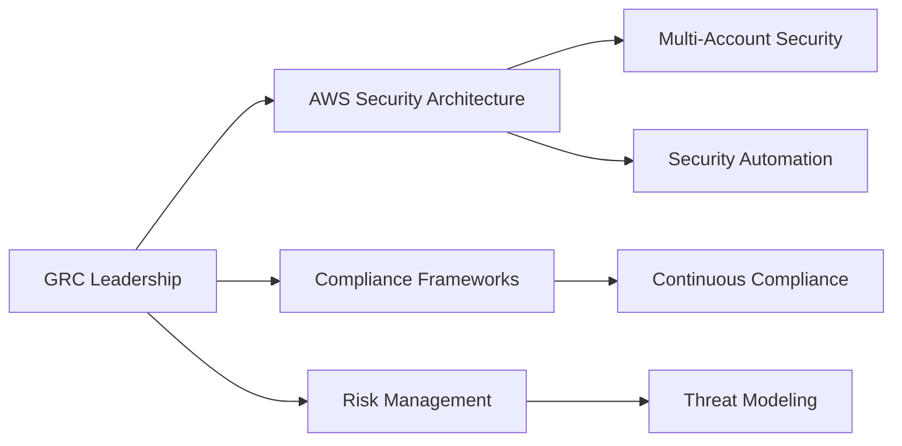

# GRC Professional Portfolio

<div align="center">
  <h1>Sarah Chen</h1>
  <p><em>AWS Security & Compliance Leader</em></p>
  
  <a href="mailto:sarah.chen@example.com"></a>
  <a href="https://linkedin.com/in/sarahchen"></a>
  <a href="https://github.com/sarahchen"></a>
  
  <p>
    
    
    
    
  </p>
</div>

## Professional Overview



With over 15 years of experience in information security and the last 8 years specializing in cloud security governance, I've led enterprise-scale AWS security transformations across financial services, healthcare, and technology sectors. My expertise lies in architecting comprehensive security and compliance programs that enable business agility while maintaining robust security postures. I've successfully guided multiple organizations through complex regulatory audits (PCI-DSS, HIPAA, SOC2) while reducing operational overhead through innovative security automation solutions.

## Areas of Expertise

<table>
  <tr>
    <td width="33%" align="center">
      <br>
      <strong>AWS Security Architecture</strong><br>
      <small>Multi-account strategies, security services implementation, defense-in-depth</small>
    </td>
    <td width="33%" align="center">
      <br>
      <strong>Compliance Automation</strong><br>
      <small>Continuous compliance, evidence collection, audit readiness</small>
    </td>
    <td width="33%" align="center">
      <br>
      <strong>Risk Management</strong><br>
      <small>Threat modeling, vulnerability management, security metrics</small>
    </td>
  </tr>
  <tr>
    <td width="33%" align="center">
      <br>
      <strong>Security as Code</strong><br>
      <small>Infrastructure as code, policy as code, security guardrails</small>
    </td>
    <td width="33%" align="center">
      <br>
      <strong>Incident Response</strong><br>
      <small>Automated detection & response, forensics, playbooks</small>
    </td>
    <td width="33%" align="center">
      <br>
      <strong>Security Leadership</strong><br>
      <small>Strategy development, team building, executive communication</small>
    </td>
  </tr>
</table>

## Impact Metrics

| Area | Metric | Impact |
|------|--------|--------|
| 🔒 Compliance | Automated compliance controls | Reduced audit preparation time by 70% |
| 📉 Risk Management | Implemented continuous risk assessment | Decreased high-risk findings by 65% |
| 💰 Cost Optimization | Optimized security tooling | Reduced security tooling costs by 40% |
| ⏱️ Incident Response | Automated incident response | Decreased MTTR from 6 hours to 30 minutes |
| 🛡️ Threat Detection | Enhanced threat detection capabilities | Improved detection coverage by 85% |

## AWS Security Architecture Blueprint

```
[A multi-account AWS security architecture diagram showing:
- Organization structure with dedicated security, audit, log archive accounts
- Centralized security services (GuardDuty, Security Hub, Config aggregator)
- Cross-account roles and monitoring
- VPC network security controls
- Data protection mechanisms
- Authentication flows]
```

*A secure multi-account AWS architecture implementing defense-in-depth with centralized security services, automated compliance checks, and least-privilege access controls, aligned with the AWS Well-Architected Framework and industry best practices.*

## Enterprise Security Portfolio

### Financial Services Security Transformation

**Business Challenge**: 
A global financial services firm needed to migrate critical applications to AWS while maintaining strict compliance with financial regulations (PCI-DSS, SOX) and establishing a consistent security posture across 200+ AWS accounts.

**Solution Architecture**:
```
[Architecture diagram showing:
- AWS Organizations structure with financial services-specific OUs
- PCI-compliant environments with network segmentation
- Automated guard rails with SCPs and Config Rules
- Centralized logging and monitoring
- Detective and preventative controls]
```

**Key Implementation Components**:
- Designed and implemented a comprehensive AWS multi-account strategy with compliance-focused organizational units
- Created a centralized security services account with cross-account monitoring and enforcement
- Implemented automated security guardrails using Service Control Policies and AWS Config
- Developed Infrastructure as Code templates for consistent security controls deployment
- Integrated security monitoring with enterprise SIEM solution for comprehensive visibility

**Quantifiable Results**:
- Achieved 99.8% compliance with PCI-DSS requirements across all in-scope AWS accounts
- Reduced security vulnerabilities by 85% through preventative controls
- Decreased mean time to remediation for security findings from days to hours
- Successfully passed four consecutive compliance audits with zero findings
- Reduced security operational overhead by 60% through automation

**Link**: [Detailed implementation repository](https://github.com/sarahchen/fs-security-framework)

### Healthcare Compliance Automation Platform

**Business Challenge**: 
A healthcare technology company struggled with maintaining HIPAA compliance across their expanding AWS environment, leading to audit failures and significant manual effort for evidence collection.

**Solution Architecture**:
```
[Architecture diagram showing:
- Automated compliance scanning and reporting
- Evidence collection pipeline
- Remediation workflow
- Audit preparation dashboard
- Integration with ticketing system]
```

**Key Implementation Components**:
- Built an automated compliance scanning solution using AWS Config, Security Hub, and custom Lambda functions
- Developed a continuous evidence collection system that automatically documented compliance controls
- Created real-time compliance dashboards for various stakeholders
- Implemented automated remediation for common compliance violations
- Designed a pre-audit readiness process that simulated audit requests

**Quantifiable Results**:
- Reduced compliance evidence collection time from 6 weeks to 3 days
- Achieved and maintained 97% compliance rate with HIPAA Security Rule
- Automated remediation of 80% of common compliance findings
- Successfully passed external HIPAA audit with commendation for compliance program
- Enabled rapid expansion to new AWS regions while maintaining compliance

**Link**: [Detailed implementation repository](https://github.com/sarahchen/healthcare-compliance-automation)

## Advanced Security Implementations

### Automated Security Compliance Framework

**Overview**: Designed and implemented an automated security compliance framework that continuously monitors, remediates, and reports on compliance posture across multiple AWS accounts.

**Technical Components**:
- AWS Config with custom rules aligned to multiple compliance frameworks
- Automated remediation using AWS Lambda and Systems Manager
- Centralized compliance dashboard using AWS Security Hub and QuickSight
- Evidence collection automation for audit readiness

**Code Snippet**:
```python
# Example of automated compliance remediation function
def remediate_noncompliant_resource(event, context):
    """AWS Lambda function to automatically remediate non-compliant resources."""
    
    # Extract resource details from AWS Config event
    resource_type = event['detail']['resourceType']
    resource_id = event['detail']['resourceId']
    
    if resource_type == 'AWS::S3::Bucket':
        # Implement S3 bucket remediation
        apply_s3_secure_transport_policy(resource_id)
    elif resource_type == 'AWS::IAM::Role':
        # Implement IAM role remediation
        apply_iam_permission_boundaries(resource_id)
    
    # Log remediation action
    print(f"Remediated {resource_type} with ID {resource_id}")
    
    return {
        'statusCode': 200,
        'body': f"Successfully remediated {resource_type}"
    }
```

**Impact**:
- Reduced manual compliance verification effort by 80%
- Decreased compliance drift by implementing continuous monitoring and remediation
- Streamlined audit process with automated evidence collection

### Security Incident Response Automation

**Overview**: Developed an automated incident response capability that detects, contains, and remediates common security incidents with minimal human intervention.

**Technical Components**:
- Amazon GuardDuty for threat detection
- Custom AWS Lambda functions for automated response actions
- Step Functions for orchestrating complex response workflows
- Integration with ticketing and notification systems

**Architecture Diagram**:
```
[Incident response architecture showing:
- Event detection sources
- Triage and assessment flow
- Automated containment actions
- Forensic collection
- Remediation process
- Human approval gates]
```

**Impact**:
- Reduced mean time to respond to critical security incidents from hours to minutes
- Automated containment of compromised resources to prevent lateral movement
- Implemented forensic data collection for post-incident analysis

## Thought Leadership & Contributions

### Publications and Presentations
- **AWS Security Automation at Scale** - AWS re:Inforce Conference - 2023
  *Presented approach to automating security controls across hundreds of AWS accounts, reaching an audience of 500+ security professionals*
- **Compliance as Code for Regulated Industries** - Cloud Security Alliance Summit - 2022
  *Published paper on implementing compliance requirements as code for financial services and healthcare organizations*

### Open Source Contributions
- **AWS Security Control Framework** - Core Contributor - [Link to Project](https://github.com/aws-samples/aws-security-control-framework)
  *Developed compliance mapping framework that maps AWS services to common regulatory requirements*
- **CloudFormation Guard Rules** - Contributor - [Link to Project](https://github.com/aws-cloudformation/cloudformation-guard)
  *Contributed policy rules for security best practices validation*

## Professional Credentials

### Certifications
- **AWS Certified Security - Specialty** - AWS - 2025
- **CISSP (Certified Information Systems Security Professional)** - ISC² - 2024
- **CCSK (Certificate of Cloud Security Knowledge)** - Cloud Security Alliance - 2023

### Education
- **Master of Science in Cybersecurity** - Stanford University - 2010
- **Advanced Cloud Security Training** - SANS Institute - 2019

## Professional Experience

### Head of Cloud Security | FinTech Innovations Inc. | 2019-Present
*Leading a team of 15 security engineers responsible for cloud security architecture, implementation, and operations across a multi-cloud environment with primary focus on AWS.*

**Key Achievements**:
- Led cloud security transformation that enabled secure migration of 300+ applications to AWS
- Established cloud security center of excellence that reduced security incidents by 75%
- Implemented security automation that reduced mean time to remediation by 85%

### Senior Cloud Security Architect | HealthSecure Systems | 2016-2019
*Responsible for designing and implementing secure cloud architecture for healthcare data processing platforms.*

**Key Achievements**:
- Designed security architecture for HIPAA-compliant healthcare data platform
- Implemented automated security controls that maintained continuous compliance
- Created cloud security training program adopted across the organization

## Contact & Engagement

I'm available for strategic security consulting, speaking engagements, and advisory roles focused on AWS security architecture, compliance automation, and enterprise security transformation.

<div align="center">
  <a href="mailto:sarah.chen@example.com"></a>
  <a href="https://linkedin.com/in/sarahchen"></a>
  <a href="https://calendly.com/sarahchen"></a>
</div>

---

<p align="center"><i>This portfolio was created using the <a href="https://github.com/sarahchen/GRC_Portfolio">GRC Portfolio Hub</a> advanced template.</i></p> 